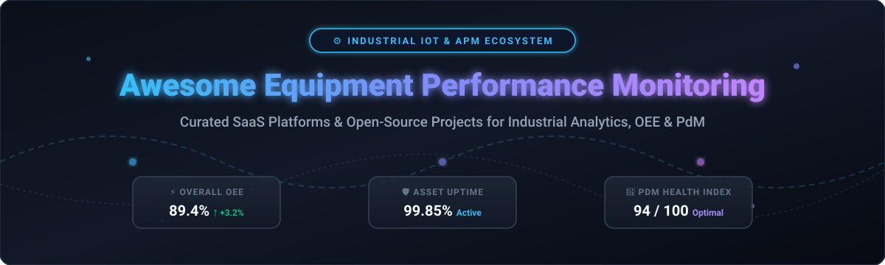
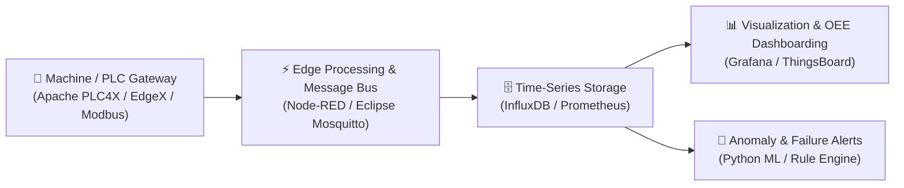

  
  
  
  
  
  

# 🏭 Awesome Equipment Performance Monitoring

> **A curated ecosystem of SaaS platforms & open-source solutions for Equipment Performance Monitoring (EPM), Overall Equipment Effectiveness (OEE), Asset Performance Management (APM), Condition Monitoring, and Predictive Maintenance (PdM).**

---

## 📌 Executive Overview & SEO Keywords

**Equipment Performance Monitoring (EPM)** combines industrial IoT (IIoT) telemetry, machine protocol acquisition (OPC-UA, Modbus, MTConnect), time-series analytics, and AI/ML reliability modeling to optimize manufacturing uptime and asset yield. 

This repository serves as a comprehensive index for manufacturing engineers, maintenance directors, CTOS, and IoT architects seeking to evaluate commercial **APM/EPM SaaS suites** alongside community **open-source industrial observability building blocks**.

*Key Topics & Search Intent:* `Equipment Performance Monitoring` • `Asset Performance Management (APM)` • `Overall Equipment Effectiveness (OEE)` • `Predictive Maintenance (PdM)` • `Condition Monitoring` • `Industrial IoT (IIoT)` • `Smart Manufacturing` • `Machine Telemetry & SCADA`

---

## 📑 Table of Contents

- [🏢 SaaS & Commercial APM Platforms](#-saas--commercial-apm-platforms)
- [🔓 Open-Source GitHub Projects](#-open-source-github-projects)
- [🏗️ Recommended Architecture Stacks](#%EF%B8%8F-recommended-architecture-stacks)
- [🤝 How to Contribute](#-how-to-contribute)
- [⚠️ Disclaimer](#%EF%B8%8F-disclaimer)
- [📈 Star History](#-star-history)
- [💖 Support & Community](#-support--community)

---

## 🏢 SaaS & Commercial APM Platforms

> **Market Analysis & Industry Structure:** The global Equipment Performance Monitoring & APM market is estimated at **$5.2 Billion** (projected to reach **$16.8 Billion** by 2030 at a **15.4% CAGR**). The market is **moderately fragmented**, with established industrial conglomerate platforms (*Applied Materials, Siemens, GE Vernova, AspenTech*) occupying enterprise semiconductor and process plant strongholds, while agile specialized AI SaaS platforms (*C3 AI, Seeq, MachineMetrics, Litmus*) capture high-growth discrete and edge monitoring niches.

Below is a curated matrix of top enterprise SaaS platforms, **sorted by Company Size / Valuation / Revenue (descending)**:

| 🏢 Platform / SaaS Product | 💰 Company Valuation / Revenue | 🏷️ Starting Pricing | 🆓 Free Tier / Trial Limits | 🎯 Primary Focus & Domain |
| :--- | :--- | :--- | :--- | :--- |
| **[Applied SmartFactory](https://www.appliedmaterials.com/)** | **~$175 Billion** *(Valuation)* | **~$5,000 / line / month** | **14-day guided sandbox demo** for enterprise fabs | Semiconductor & high-tech fab automation, yield management, and equipment efficiency. |
| **[Siemens Insights Hub](https://www.siemens.com/)** | **~$150 Billion** *(Valuation)* | **~$250 / month** *(Basic IoT package)* | **30-day free trial** *(Up to 5 assets & 10GB storage limit)* | Industrial IoT & manufacturing intelligence platform (formerly MindSphere) for Siemens PLCs. |
| **[GE Digital APM](https://www.ge.com/digital/)** | **~$48 Billion** *(Valuation - GE Vernova)* | **~$1,200 / asset / year** | **30-day enterprise trial** *(Up to 10 asset profiles)* | Asset Performance Management suite for power generation, oil & gas, and heavy manufacturing. |
| **[Aspen Mtell](https://www.aspentech.com/)** | **~$15 Billion** *(Market Cap)* | **~$800 / asset / month** | **30-day proof-of-concept trial** environment | Prescriptive maintenance and failure prediction algorithms for chemical and process industries. |
| **[C3 AI Reliability](https://c3.ai/)** | **~$3.2 Billion** *(Market Cap)* | **~$0.55 / vCPU-hour** *(~$10k/mo node)* | **14-day developer trial** *(Up to 100 vCPU-hours limit)* | Enterprise AI reliability application for monitoring heavy machinery & equipment fleets. |
| **[PDF Solutions Exensio](https://www.pdf.com/)** | **~$1.4 Billion** *(Market Cap)* | **~$2,500 / module / month** | **14-day evaluation sandbox** environment | Big data analytics platform focused on semiconductor equipment health, test, and yield. |
| **[Seeq SaaS](https://www.seeq.com/)** | **~$750 Million** *(Est. Valuation)* | **~$500 / user / month** | **30-day full-feature trial** *(Up to 5 users & 100 time-series tags)* | Advanced time-series investigation and condition monitoring for continuous process manufacturing. |
| **[Litmus Edge](https://litmus.io/)** | **~$250 Million** *(Est. Valuation)* | **~$295 / edge device / month** | **30-day free trial** *(Up to 5 device connections limit)* | Industrial edge and data platform for collecting and normalizing machine telemetry across PLCs. |
| **[MachineMetrics](https://www.machinemetrics.com/)** | **~$180 Million** *(Est. Valuation)* | **~$200 / machine / month** | **14-day free trial** *(Up to 3 CNC machine connections)* | Automated machine monitoring and OEE tracking specialized in CNC and discrete manufacturing. |
| **[Braincube](https://braincube.com/)** | **~$120 Million** *(Est. Valuation)* | **~$1,500 / site / month** | **30-day interactive sandbox** with sample datasets | Edge & cloud industrial IoT platform for manufacturing process optimization and equipment APM. |

---

## 🔓 Open-Source GitHub Projects

Open-source technologies form the backbone of self-hosted equipment monitoring, time-series storage, edge gateways, and custom OEE dashboards.

Below is a curated index of leading open-source projects, **sorted by GitHub Stars_Count (descending)**:

| 📦 Repository & Link | ⭐ Star Rating Badge | 📝 Core Capabilities in EPM / IIoT Ecosystem |
| :--- | :--- | :--- |
| **[Home Assistant Core](https://github.com/home-assistant/core)** |  | Open-source engine frequently used for lightweight sensor tracking, power telemetry, and condition triggers. |
| **[Grafana](https://github.com/grafana/grafana)** |  | De facto standard open-source visualization dashboarding engine for equipment KPIs, real-time OEE, and sensor telemetry. |
| **[Prometheus](https://github.com/prometheus/prometheus)** |  | Cloud-native time-series metrics collection and alerting engine paired with Grafana for equipment telemetry monitoring. |
| **[InfluxDB](https://github.com/influxdata/influxdb)** |  | Purpose-built high-performance time-series database optimized for high-frequency machine sensors and industrial metrics. |
| **[Node-RED](https://github.com/node-red/node-red)** |  | Low-code flow programming editor ideal for wiring PLC protocols (Modbus, OPC-UA, MQTT) and building edge data pipelines. |
| **[ThingsBoard](https://github.com/thingsboard/thingsboard)** |  | Open-source IoT platform offering out-of-the-box equipment telemetry dashboards, asset hierarchy, and rule engine alerts. |
| **[Telegraf](https://github.com/influxdata/telegraf)** |  | Plugin-driven server agent for capturing equipment performance counters, MQTT topics, and system metrics. |
| **[Eclipse Mosquitto](https://github.com/eclipse/mosquitto)** |  | Lightweight MQTT broker providing efficient pub/sub backbone for plant-floor machine-to-cloud telemetry. |
| **[KubeEdge](https://github.com/kubeedge/kubeedge)** |  | Kubernetes-native edge computing infrastructure for orchestrating equipment monitoring microservices on shop floors. |
| **[EdgeX Foundry](https://github.com/edgexfoundry/edgex-go)** |  | Linux Foundation vendor-neutral open edge IoT framework for unifying industrial machine protocol acquisition. |
| **[Apache StreamPipes](https://github.com/apache/streampipes)** |  | Industrial IoT platform enabling non-developers to configure live stream analytics pipelines for machine telemetry. |
| **[Apache PLC4X](https://github.com/apache/plc4x)** |  | Universal set of industrial protocol drivers (Modbus, Siemens S7, EtherNet/IP, OPC-UA) for direct PLC integration. |
| **[Scada-LTS](https://github.com/scada-lts/Scada-LTS)** |  | Open-source SCADA project designed for equipment telemetry monitoring, alarm management, and process control. |

---

## 🏗️ Recommended Architecture Stacks

For organizations looking to build self-hosted equipment monitoring stacks, the following pipeline is recommended:

---

## 🤝 How to Contribute

Contributions are welcome and appreciated! Follow these steps to submit additions:

1. 🍴 **Fork** this repository.
2. 📝 Edit `README.md` to add your proposed SaaS or open-source tool.
3. 📌 Follow the table format (include specific pricing, free limits, valuation/revenue, and Stars_Badges).
4. 🚀 Submit a **Pull Request** with a clear explanation of why the addition is valuable.

See [Awesome List Guidelines](https://github.com/ishandutta2007/Awesome-Awesome-Awesome) for quality standards.

---

## ⚠️ Disclaimer

- This repository is a **community-curated index** provided for informational purposes only.
- Equipment monitoring, condition monitoring, and predictive maintenance applications impact industrial safety, operational downtime, and machinery longevity. Self-hosted setups require proper domain validation before production deployment.

---

## 📈 Star History

---

## 💖 Support & Community

Thank you for exploring **Awesome Equipment Performance Monitoring**! If you find this curated list valuable for your manufacturing, reliability engineering, or industrial IoT work:

- ⭐ **Star** this repository to help others discover it.
- 🔀 **Fork** it to keep your own reference copy.
- 📢 **Share** it with fellow reliability engineers and smart manufacturing practitioners.
- ☕ **Buy me a coffee**: Support ongoing curation and open-source industrial tooling via the [GitHub Sponsor Dashboard](https://github.com/sponsors/ishandutta2007).
